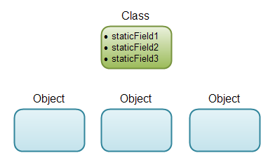

# Java Class Building Blocks

A Java Class can contain the following building blocks

- Fields
- Constructors
- Methods
- Nested Classes

## Java Fields

A Java field is a variable inside a class. for instance in a class representing an employee, the **Employee** class might contain the following fields:
- name
- position
- salary
- hiredDate

public class Employee{
    String name;
    String position;
    int salary;
    Date hiredDate;
}

### Field Declaration Syntax

A Java filed is declared using the following syntax:

> [*access_modifier*] [*static*] [*final*] type name [*= initial value*];

square brackets [ ] around some of the keywords mean that this option is optional. Only type and name are required.

#### Filed Access Modifiers

Java filed access modifier determines whether the field can be accessed by classes other than the class owning the field.

- private            \- classe level
- package or default \- package level
- protected          \- Subclass level even from different package
- public             \- any classes can access it

public class Customer{
    private   String email;
              String position;
    protected String name;
    public    String city;
}

#### Static and Non-Static Fields

A static field belongs to the class, thus, no matter how many objects you create of that class, there will only exist one field located in the class.

public class Customer{
    static String staticFields1;
}

Static fields are located in the class, so you don't need an instance of the class to access static fields. You just write the class name in front like this

Customer.staticField1 = "value";
System.out.println(Customer.staticField1);

